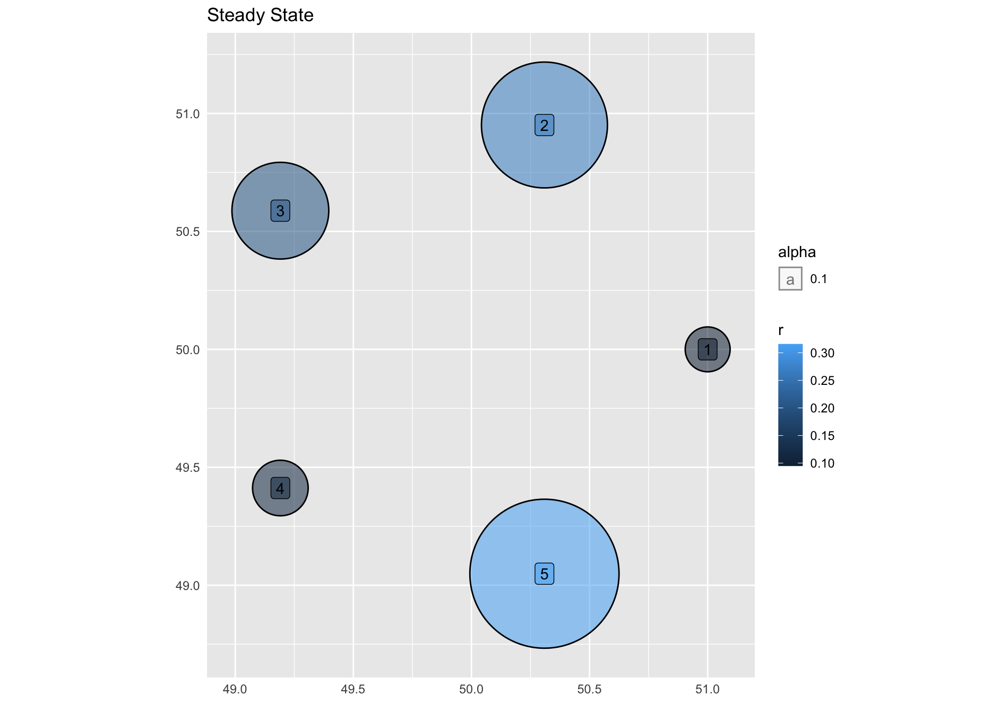

# markov-vis
An exploratory R package for calculating Markov Chains, visualizing Page Rank conclusions, and manipulating data frames as Markov Matrices.

 

# USAGE
For function definitions - 
?markov-vs

This package works to enable some alternate plot and visualizations techniques, as well as built in methods of building and simulating Markov Matrices and Chains. 
